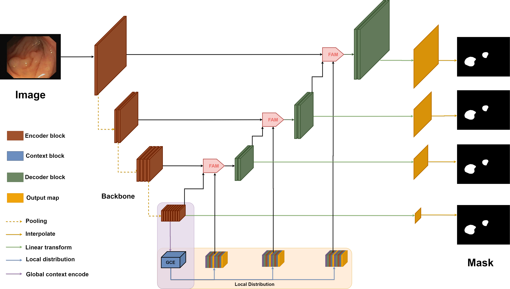
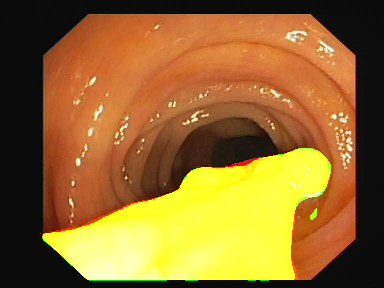
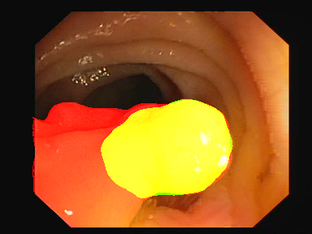
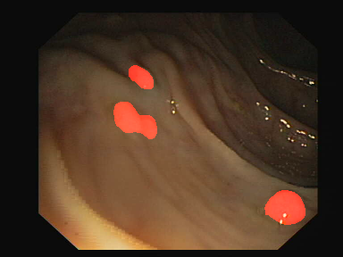

## Model



## How to run GCEE-RCCA ?

### Prepare code, pretrained and [dataset](#dataloader-dataloader-name)

```sh
git clone https://github.com/kiyoshitaro/polyp_segmentation.git
cd polyp_segmentation
mkdir pretrained
cd pretrained
wget https://github.com/PingoLH/Pytorch-HarDNet/blob/master/hardnet68.pth?raw=true
mv hardnet68.pth?raw=true hardnet68.pth
cd ..
```

### Install library

- with colab(https://www.kaggle.com/kiyoshitaro/polyp-segment):

```sh
!pip install loguru
!pip install torchsummary
!pip install inplace_abn
!pip install thop
!pip install ml_collections
!pip install torchsummaryX
!pip install einops
!pip uninstall -y keras
```

- with clear conda

```sh
!pip install -r requirements.txt
```

### Check model size

```sh
!python check_size.py -m SCWSRCCANet
```

### Train

```sh
CUDA_VISIBLE_DEVICES=0 python my_train.py -c configs/colab_config.yaml
```

### Test

```sh

CUDA_VISIBLE_DEVICES=0 python my_test.py -c configs/colab_config.yaml
```

### Infer & visualize

```sh
python infer_one.py
```

### Monitor

```sh
tensorboard --logdir=runs
```

### Run distillation:

First run my_test.py with visualize = True to generate soft label of first training

Run

```sh
CUDA_VISIBLE_DEVICES=1 python mytrain_distillation.py -c configs/gcee_chase_config.yaml
```

## Option:

watch in gcpa_gald_net_config.yaml file

### [Dataloader](dataloader) (dataloader. name)

All data must put in ./data, follow the tree:

```bash
.
├── Kvasir_SEG_Training_880
│   ├── images
│   │   ├── cju0qkwl35piu0993l0dewei2.png
│   │   ├── cju0qoxqj9q6s0835b43399p4.png
│   └── masks
│       ├── cju0qkwl35piu0993l0dewei2.png
│       ├── cju0qoxqj9q6s0835b43399p4.png
└── Kvasir_SEG_Validation_120
    ├── images
    │   ├── cju0s690hkp960855tjuaqvv0.png
    │   ├── cju0sr5ghl0nd08789uzf1raf.png
    └── masks
        ├── cju0s690hkp960855tjuaqvv0.png
        ├── cju0sr5ghl0nd08789uzf1raf.png
```

- KvasirDataset:

  - Kvasir-SEG: [test](https://drive.google.com/file/d/1us5iOMWVh_4LAiACM-LQa73t1pLLPJ7l/view?usp=sharing), [train](https://drive.google.com/file/d/17sUo2dLcwgPdO_fD4ySiS_4BVzc3wvwA/view?usp=sharing)
  - Kvasir-SEG, CVC-ColonDB, EndoScene, ETIS-Larib Polyp DB and CVC-Clinic DB: [test](https://drive.google.com/file/d/1o8OfBvYE6K-EpDyvzsmMPndnUMwb540R/view?usp=sharing), [train](https://drive.google.com/file/d/1lODorfB33jbd-im-qrtUgWnZXxB94F55/view?usp=sharing)
  - Kvasir-Instrument : [data](https://datasets.simula.no/kvasir-instrument/)
  - Kvasir-5folds: [data](https://drive.google.com/drive/folders/1-2RperHzW0Ea6ijBajx5fOhqM0_eg6BU?usp=sharing)

- ISICDataset:

  - [data](https://challenge.isic-archive.com/data#2018)
  - ISICBCDU: [code](utils/preprocess_isic.py) to split train dataset isic2018 to train-val-test: 1815-259-520 ~ 70:10:20 (follow [paper](https://github.com/rezazad68/BCDU-Net/blob/master/Skin%20Lesion%20Segmentation/Prepare_ISIC2018.py))
  - [code](utils/augment_isic.py) to augment offline and resize image to low-resolution because of bottleneck
  - Submit :
    - 1000 images with name ISIC\_<image_id>\_segmentation.png
      - 0: representing the background of the image, or areas outside the primary lesion
      - 255: representing the foreground of the image, or areas inside the primary lesion
    - metric : MeanIou
    - [link](https://challenge.isic-archive.com/task/49)

- USNerveDataset:

  - [data](https://www.kaggle.com/c/ultrasound-nerve-segmentation/data?fbclid=IwAR3Rly_-HfPylAAHSbEiX5a9Pt42VSXPwou4WEnuNHjl5GML5VOKrhLH2Ik)
  - Submit:
    - run mytest_usnerve.py
    - 5508 images encoded with rle into submission.csv

- BraTSDataset:

  - [data](https://www.med.upenn.edu/sbia/brats2018/data.html)
  - [code](utils/preprocess_nii.py) to preprocess nii file to pkl 3D image
  - Submit
    - 66 file endwith .nii.gz
    - [link](https://ipp.cbica.upenn.edu/jobs/306528931856371887)

- ChaseDataset:

  - [data](https://drive.google.com/file/d/1RnPR3hpKIHnu0e3y9DBOXKPXuiqPN8hg/view?usp=sharing)

- 2018 Data Science Bowl
  - [data](https://www.kaggle.com/c/data-science-bowl-2018/overview)

### [Loss](network/optim/losses) (loss)

- dice_loss, structure_loss, bce_loss, focal_loss
- GeneralizedDiceLoss : for 3D & multiclass

### [Schedule](network/optim/schedulers.py) (scheduler)

- cosine, cosine_warmup

### [Model](network/model)

- [GCEE-Lambda](network/model/gcpanet/scws_lambda.py): [weight](https://drive.google.com/file/d/1-kmsWoBA82K45wNIb1LuQBIzZrjsgYq3/view?usp=sharing), ~/hung/polyp_segmentation/snapshots/SCWSLambdaNet_kfold
- [GCEE-CC](network/model/gcpanet/scws_rcca.py): SCWSRCCANet, [weight](https://drive.google.com/file/d/1gPOooAfjVXOYtNbb-s2fjpchAPzu8irH/view?usp=sharing) , ~/hung/polyp_segmentation/snapshots/SCWSRCCANet_kfold

- [GCEE-PSP](network/model/gcpanet/scws_psp.py): [weight]()

- [GCPA-CC](network/model/gcpanet/gcpa_rcca.py): GCPARCCANet , [weight](https://drive.google.com/file/d/1lK7TlwQss-Eaq_1tmbSs0K_Sxpx4jBSw/view?usp=sharing) , ~/hung/polyp_segmentation/snapshots/GCPARCCANet_kfold
- [GCPA-PSP](network/model/gcpanet/gcpa_psp.py): GCPAPSPNet, [weight](https://drive.google.com/file/d/1UryKN1277zHJrvKwg8DyvQ54gsGXOTq8/view?usp=sharing) , /mnt/data/hungnt/snapshots/GCPAPSPNet_kfold/
- [GCPA-ASPP](network/model/gcpanet/gcpa_aspp.py): GCPAASPPNet, [weight](https://drive.google.com/file/d/18p1DurjbUzpaR7Zugd9co9pPsLmr8-uT/view?usp=sharing) , /mnt/data/hungnt/snapshots/GCPAASPPNet_kfold

- [GCPA-CGNL](network/model/gcpanet/gcpa_gald_v8.py): GCPAGALDNetv8, [weight](https://drive.google.com/file/d/1VIN0T9OmMRChbbo51c6gMnfj5b4qojMQ/view?usp=sharing) , /mnt/data/hungnt/snapshots/GCPAGALDNetv8_kfold

- [GCEE-PSP](network/model/gcpanet/scws_psp.py) in Kvasir-SEG with img_size = 512: [weight](https://drive.google.com/file/d/1ta1soiRbLBkIz3UoBx0LKOfw2FLWrXga/view?usp=sharing) , ~/hung/polyp_segmentation/snapshots/SCWSPSPNet_512_SEG/
- [GCEE-CC](network/model/gcpanet/scws_rcca.py) in Kvasir-instrument: [weight](https://drive.google.com/file/d/1FDDgXdLrVSSs0NxwpO0sZzh0aAcIxygz/view?usp=sharing) , ~/hung/polyp_segmentation/snapshots/SCWSRCCANet_instrument/

### Pretrain (put all in folder ./pretrained)

[pretrain](https://drive.google.com/drive/folders/1RO6e7j3LRgGp2HQalZejxvVuKu0jZZPq?usp=sharing)

## Technique

- Cosine with warmup scheduler
- structure_loss with ssim
- Data augmentation + Multiscale
- Self-distillation: watch [mytrain_distillation](./mytrain_distillation.py) and see arch_teacher, weight_teacher_path params and train with distillation_loss and num_epoch small
- Self-distillation offline with test dataset (run [my_test_softlabel](./my_test_softlabel.py) to generate test_distill image (only keep not mask) and use these as traindataset and no need distillation_loss, just train normally with my_train.py
- Test time augmentation

## Sample

- green : prediction
- red : groundtruth
- yellow: overlap

### GCEE-RCCA (Our):

|                       21.png                       |                       14.png                       |                       73.png                       |                       154.png                       |                       205.png                       |                       25.png                       |
| :------------------------------------------------: | :------------------------------------------------: | :------------------------------------------------: | :-------------------------------------------------: | :-------------------------------------------------: | :------------------------------------------------: |
|  |  |  |  |  |  |

### UNet

|                21.png                |                14.png                |                73.png                |                154.png                |                205.png                |                25.png                |
| :----------------------------------: | :----------------------------------: | :----------------------------------: | :-----------------------------------: | :-----------------------------------: | :----------------------------------: |
|  |  |  |  |  |  |

### PraNet

|                  21.png                  |                  14.png                  |                  73.png                  |                  154.png                  |                  205.png                  |                  25.png                  |
| :--------------------------------------: | :--------------------------------------: | :--------------------------------------: | :---------------------------------------: | :---------------------------------------: | :--------------------------------------: |
|  |  |  |  |  |  |

### GT

|                    21.png                     |                    14.png                     |                    73.png                     |                    154.png                     |                    205.png                     |                    25.png                     |
| :-------------------------------------------: | :-------------------------------------------: | :-------------------------------------------: | :--------------------------------------------: | :--------------------------------------------: | :-------------------------------------------: |
|  |  |  |  |  |  |
