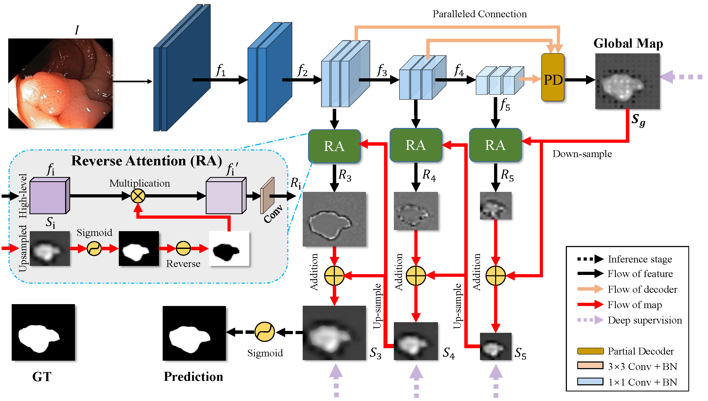
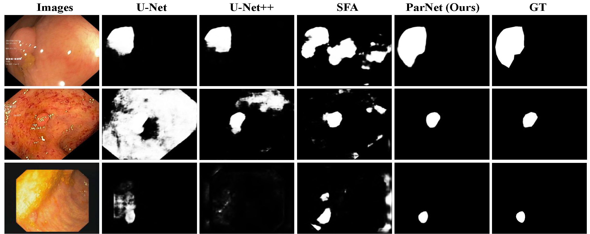

# PraNet: Parallel Reverse Attention Network for Polyp Segmentation (MICCAI2020-Oral)

> **Authors:** 
> [Deng-Ping Fan](https://dpfan.net/), 
> [Ge-Peng Ji](https://scholar.google.com/citations?user=oaxKYKUAAAAJ&hl=en), 
> [Tao Zhou](https://taozh2017.github.io/),
> [Geng Chen](https://www.researchgate.net/profile/Geng_Chen13), 
> [Huazhu Fu](http://hzfu.github.io/), 
> [Jianbing Shen](http://iitlab.bit.edu.cn/mcislab/~shenjianbing), and 
> [Ling Shao](http://www.inceptioniai.org/).

## 1. Preface

- If you have any questions about our paper, feel free to contact me. And if you are using PraNet 
or evaluation toolbox for your research, please cite this paper ([BibTeX](#4-citation)).

<!-- ### 1.2. Table of Contents

- [PraNet: Parallel Reverse Attention Network for Polyp Segmentation (MICCAI 2020)](#pranet--parallel-reverse-attention-network-for-polyp-segmentation--miccai-2020-)
  * [1. Preface](#1-preface)
    + [1.1. :fire: NEWS :fire:](#11--fire--news--fire-)
    + [1.2. Table of Contents](#12-table-of-contents)
  * [2. Overview](#2-overview)
    + [2.1. Introduction](#21-introduction)
    + [2.2. Framework Overview](#22-framework-overview)
    + [2.3. Qualitative Results](#23-qualitative-results)
  * [3. Proposed Baseline](#3-proposed-baseline)
    + [3.1 Training/Testing](#31-training-testing)
    + [3.2 Evaluating your trained model:](#32-evaluating-your-trained-model-)
    + [3.3 Pre-computed maps:](#33-pre-computed-maps)
  * [4. Citation](#4-citation)
  * [5. TODO LIST](#5-todo-list)
  * [6. FAQ](#6-faq)

<small><i><a href='http://ecotrust-canada.github.io/markdown-toc/'>Table of contents generated with markdown-toc</a></i></small> -->

  

## 2. Overview
### 2.2. Framework Overview

      
    <em> 
    Figure 1: Overview of the proposed PraNet, which consists of three reverse attention 
    modules with a parallel partial decoder connection. See § 2 in the paper for details.
    </em>

### 2.3. Qualitative Results

      
    <em> 
    Figure 2: Qualitative Results.
    </em>

## 3. Proposed Baseline

### 3.1. Training/Testing

### 3.2 Evaluating your trained model:

One-key evaluation is written in MATLAB code ([link](https://drive.google.com/file/d/1_h4_CjD5GKEf7B1MRuzye97H0MXf2GE9/view?usp=sharing)), 
please follow this the instructions in `./eval/main.m` and just run it to generate the evaluation results in `./res/`.
The complete evaluation toolbox (including data, map, eval code, and res): [link](https://drive.google.com/file/d/1qga1UJlIQdHNlt_F9TdN4lmmOH4gN7l2/view?usp=sharing). 

### 3.3 Pre-computed maps: 
They can be found in [download link](https://drive.google.com/file/d/1tW0OOxPSuhfSbMijaMPwRDPElW1qQywz/view?usp=sharing).

## 4. Citation

    @article{fan2020pra,
    title={PraNet: Parallel Reverse Attention Network for Polyp Segmentation},
    author={Fan, Deng-Ping and Ji, Ge-Peng and Zhou, Tao and Chen, Geng and Fu, Huazhu and Shen, Jianbing and Shao, Ling},
    journal={MICCAI},
    year={2020}
    }

## 5. TODO LIST

> If you want to improve the usability or any piece of advice, please feel free to contact me directly ([E-mail](gepengai.ji@gmail.com)).

- [ ] Support different backbones (
VGGNet, 
ResNet, 
[ResNeXt](https://github.com/facebookresearch/ResNeXt),
[iResNet](https://github.com/iduta/iresnet), 
and 
[ResNeSt](https://github.com/zhanghang1989/ResNeSt) 
etc.)

- [ ] Support distributed training.

- [ ] Support lightweight architecture and real-time inference, like MobileNet, SqueezeNet.

## 6. FAQ

    [Solution Link](https://blog.csdn.net/weixin_42128813/article/details/102915578)
